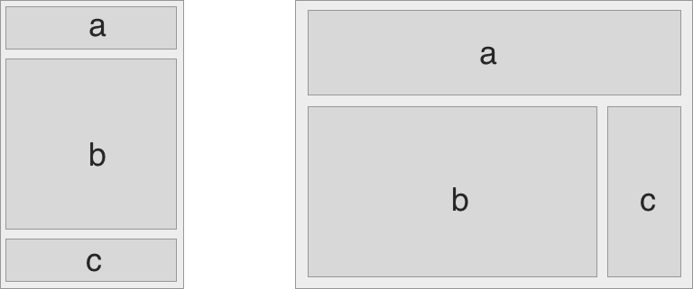
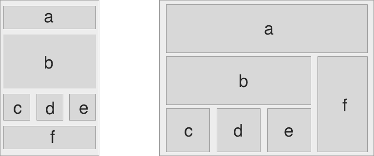
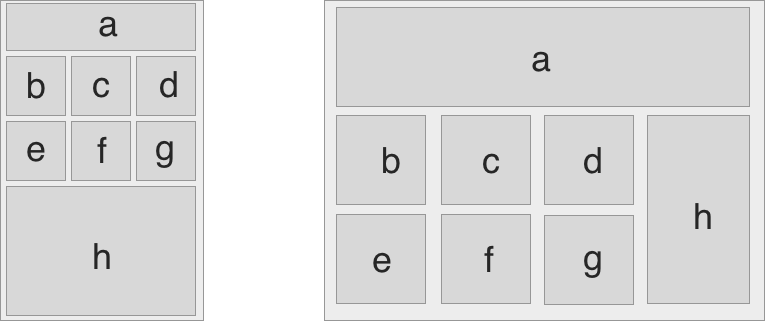

# Responsive Mockups

Take these designs and make them into a simple website!

## Get Started

- each folder has an `index.html` and a `main.css`
- each should have some starter divs and the css should be linked. Check to make sure!
- Feel free to add colors and borders to help you visualize your page
- Remember - divs with no content, by default, have a height and width of 0. Use your dev tools and set min-height/min-width, as needed

### Media Query 1

### Media Query 2

### Media Query 3

